# Xiaoling Voice Intelligence

**小聆｜客户声音智能分析平台**

> A LangGraph-based multi-agent system that turns noisy customer feedback into evidence-backed signals, accountable decisions, and trackable action.

客户声音分散在客服对话、评论、投诉、社交媒体、问卷和工单中。真正影响品牌、服务和产品决策的信号，往往被重复内容、情绪表达和低信息量反馈淹没。Xiaoling Voice Intelligence 通过“降噪、聚合、识别、分级、路由”将原始声音转化为带证据、优先级、责任团队和下一步动作的事件材料。

## 业务价值

| 业务角色 | 关键问题 | 产品输出 |
| --- | --- | --- |
| 品牌与公关负责人 | 哪些声音可能形成公开传播风险 | 风险等级、传播证据、相似事件与复核建议 |
| 客服负责人 | 哪些对话存在话术、承诺或升级风险 | 对话质检、SOP 引用、问题定位与整改动作 |
| 运营与产品负责人 | 哪些反馈值得进入产品和运营优先级 | 问题聚合、影响范围、责任团队与任务建议 |
| 风险复核负责人 | 哪些结论必须由人确认 | 结构化复核包、受控选项和完整审计记录 |

## 产品界面

### 客户声音工作台

从真实分析记录汇总高价值信号、待人工复核、当前任务和 Agent 使用情况，帮助团队先处理最值得关注的声音。

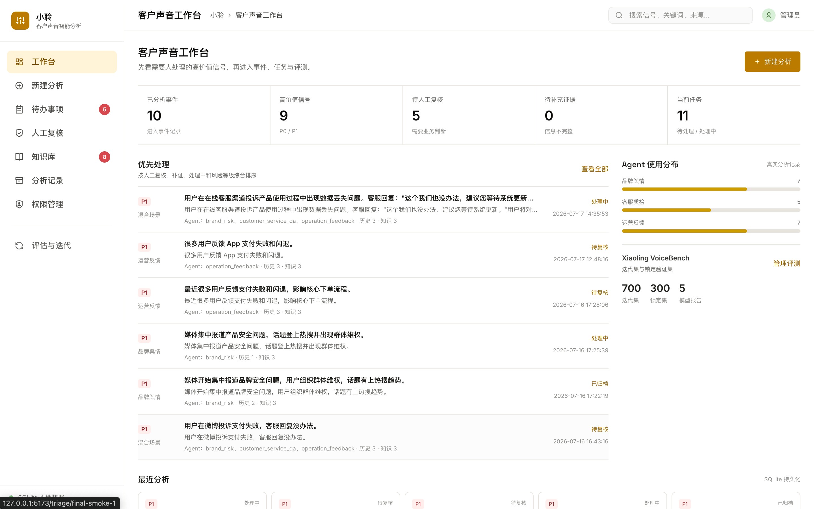

### 可解释的 Agent 分析过程

分析过程展示 Input Gate、Supervisor 路由、专业 Agent、知识与历史事件匹配、风险校准等执行阶段；事件结论只在分析完成后出现。

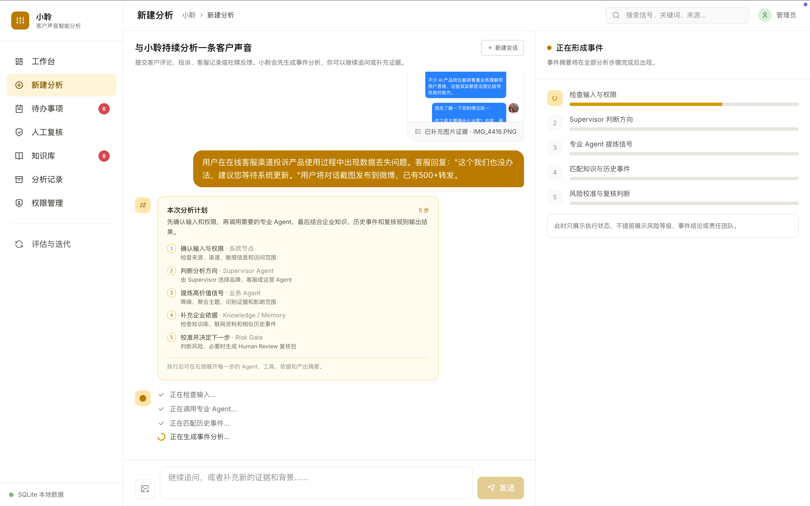

### 对话内人工复核与事件预览

同一工作区支持持续追问、补充图片或文件证据、查看右侧事件结论，并在高风险动作前完成受控人工判断。

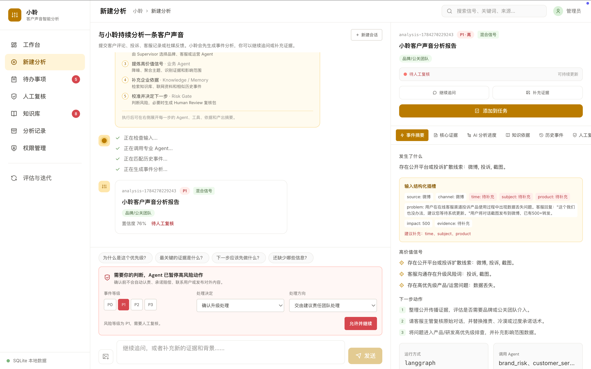

<details>
<summary><strong>事件处置与生命周期</strong></summary>

#### 任务中心

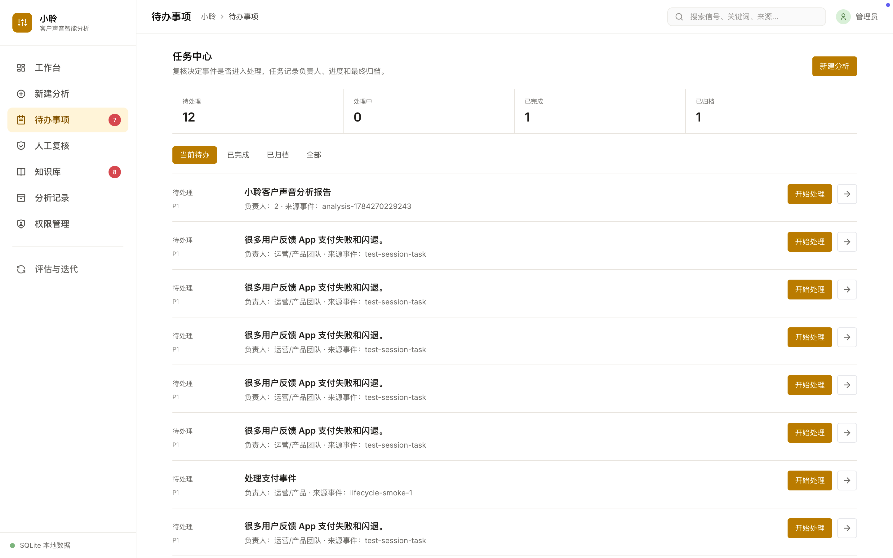

#### 事件详情

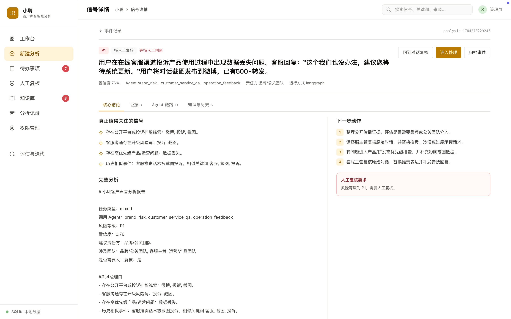

#### 人工复核队列

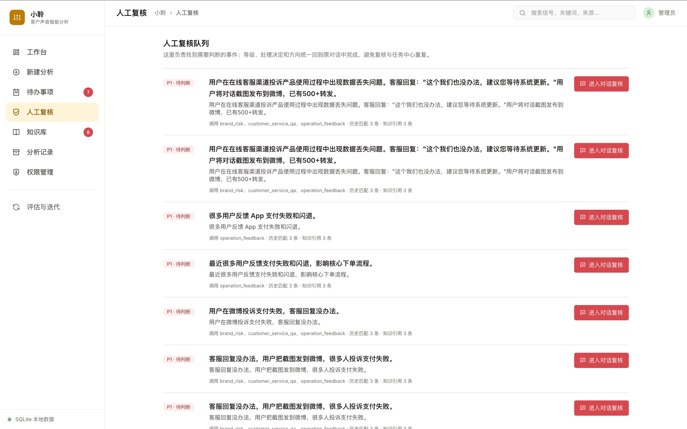

#### 历史事件记录

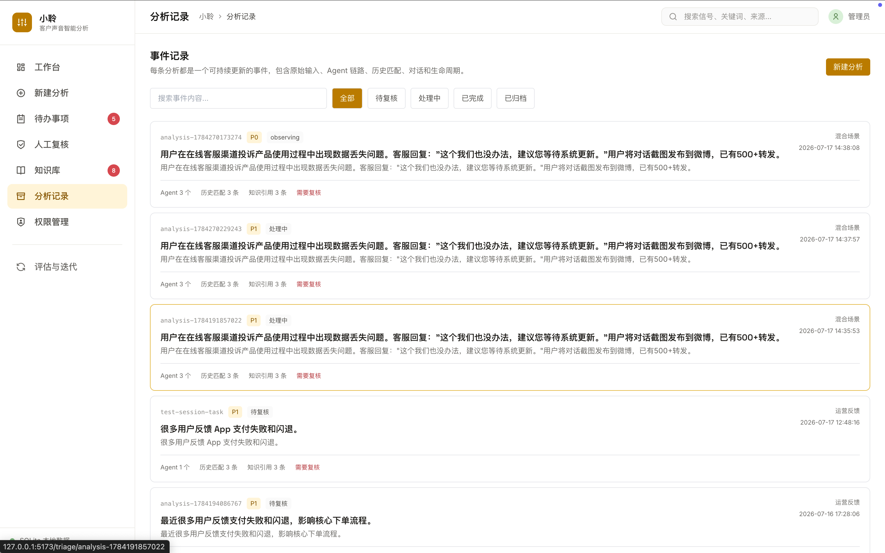

</details>

<details>
<summary><strong>知识库、RAG 与权限</strong></summary>

#### 知识空间概览

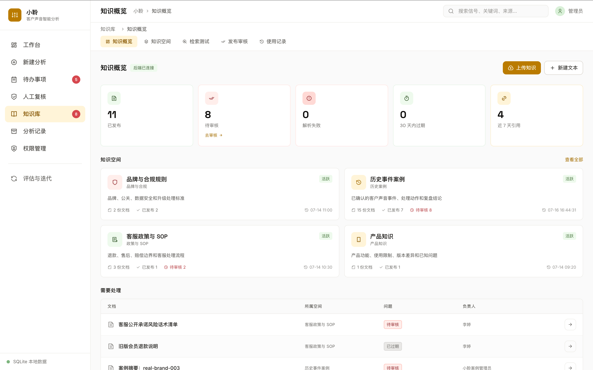

#### RAG 检索测试

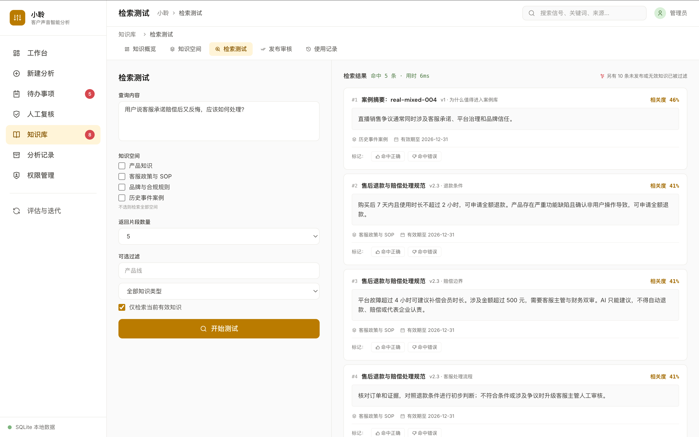

#### 知识发布审核

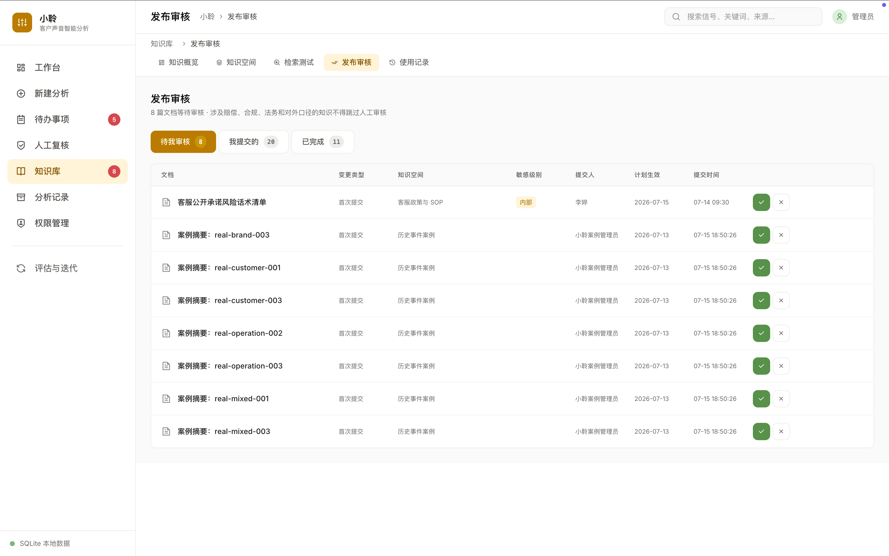

#### 角色与权限边界

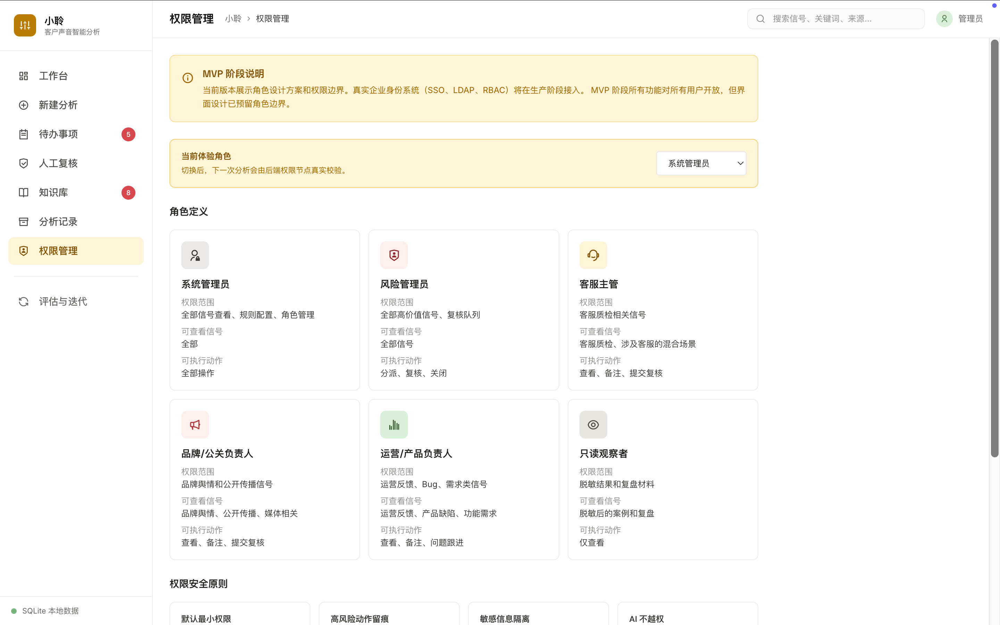

</details>

<details>
<summary><strong>VoiceBench 评测与 Bad Case 迭代</strong></summary>

#### 多模型评测概览

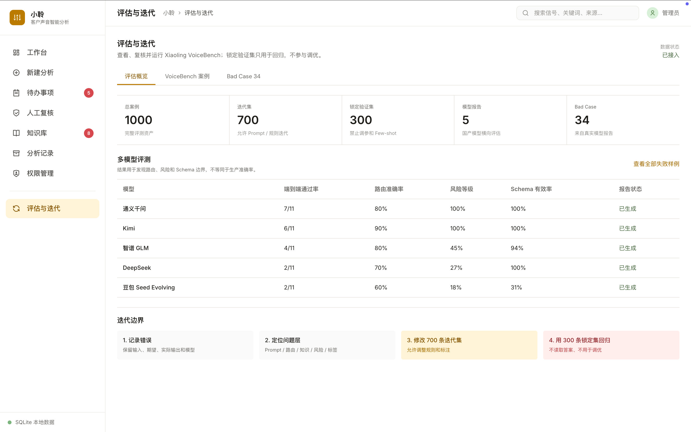

#### 1000 条 VoiceBench 案例

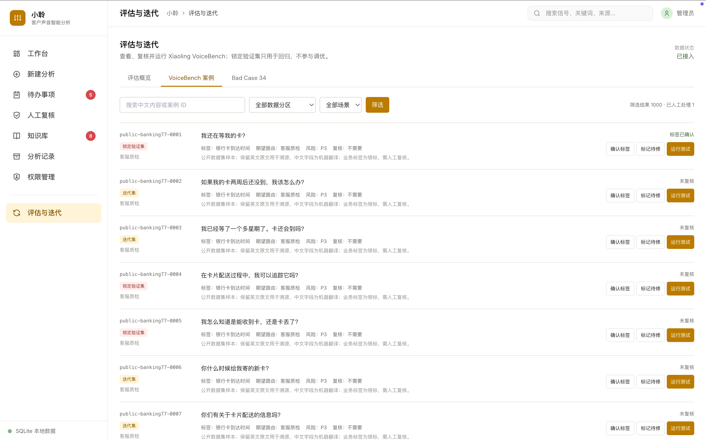

#### Bad Case 回归

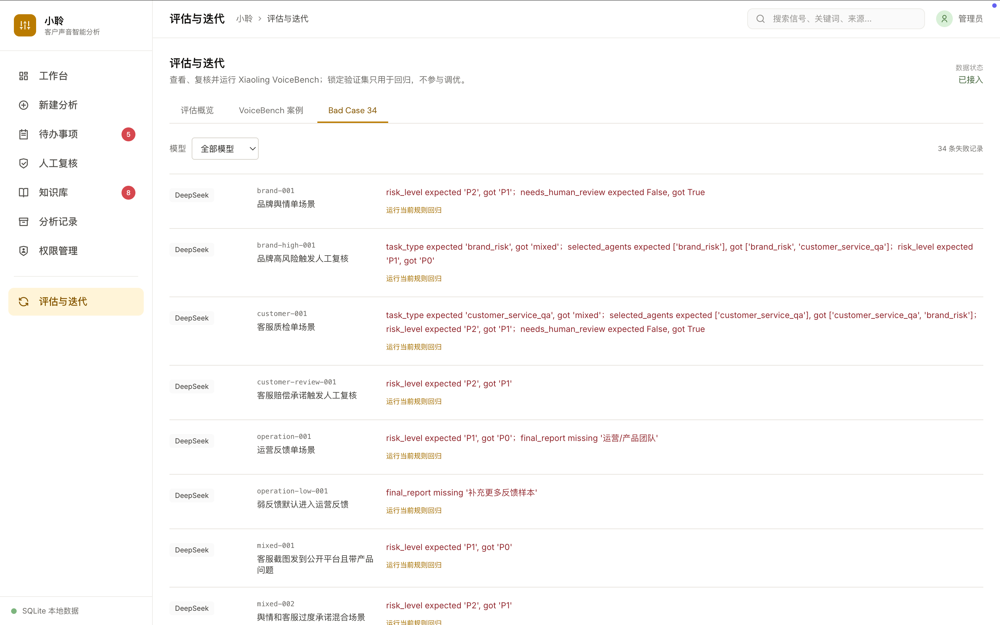

</details>

## 产品工作流

```text
多渠道客户声音
  -> 输入完整性与权限检查
  -> Supervisor 识别任务并路由专业 Agent
  -> 品牌舆情 / 客服质检 / 运营反馈分析
  -> 企业知识检索与历史事件匹配
  -> 确定性风险校准
  -> 人工复核或形成行动建议
  -> 多轮追问、任务跟进、归档与 Bad Case 回流
```

产品不是一次性生成报告的聊天工具。同一事件可以持续补充图片和文件证据、追问分析依据、进入人工复核、创建任务，并在处理完成后归档。分析、对话、任务、知识引用和人工决定通过同一个事件 ID 关联。

## 核心设计

### Multi-Agent 编排

Supervisor 负责识别任务类型，不直接代替专业判断。品牌舆情 Agent、客服质检 Agent 和运营反馈 Agent 分别拥有独立的工具组合、执行顺序和输出契约。共享 State 保存事实、证据、路由、风险、知识引用、历史事件和人工复核状态。

### 可控的 Agent 边界

语义理解和专业判断交给 Agent；输入校验、权限、风险校准、人工复核和审计保留为确定性系统节点。涉及认责、赔偿、公开回应、法律判断或联系用户的动作不能由模型自动执行。

### 企业知识与历史记忆

RAG 知识库管理产品知识、客服 SOP、品牌合规规则和外部案例。检索前执行权限、发布状态和有效期过滤，输出文档版本与片段引用。Memory Match 用于匹配历史事件，帮助团队判断是否为重复问题、风险复发或已验证的处置模式。

### AI Native 工作空间

管理端围绕事件而不是页面菜单组织工作：左侧保留多轮沟通记录，中间展示当前分析和可执行操作，右侧同步预览事件结论、Agent/工具轨迹、证据、知识引用与生命周期状态。

## 评测与迭代

项目建立了 **Xiaoling VoiceBench**：700 条迭代集与 300 条锁定验证集。锁定集不参与 Prompt、Few-shot、规则或知识库调优，降低验证集泄漏风险；自动银标用于趋势诊断，关键业务标签需要人工复核为金标。

同一任务契约下完成 DeepSeek、豆包、通义千问、Kimi 和智谱的结构化横评，覆盖路由、风险等级、Schema 有效率和端到端通过率。评测用于发现模型边界和推动系统改进，不被包装为生产准确率。

Bad Case 闭环：

```text
记录错误 -> 定位 Prompt / 路由 / 知识 / 风险边界 / 标签问题
-> 修改迭代集或系统策略 -> 锁定集回归 -> 通过后更新
```

## 工程架构

```text
Input Gate -> Permission Check -> Supervisor
                                   |-- Brand Risk Agent
                                   |-- Customer Service QA Agent
                                   `-- Operation Feedback Agent
                                             |
                       Knowledge Retrieval + Memory Match
                                             |
                                   Risk Calibration
                                             |
                           Human Review Gate / Final Report
                                             |
                              Trace + SQLite Persistence
```

技术栈：`LangGraph` `Python` `SQLite` `RAG` `Pydantic Schema` `LangSmith` `React` `TypeScript`

## 项目成果

- 完成从产品定位、交互原型到 LangGraph 工作流和管理端的端到端 MVP；
- 建立 Supervisor + 3 个专业 Agent，并明确 Agent 与确定性系统节点的职责边界；
- 实现多轮事件分析、知识引用、历史事件匹配、人工复核、任务跟进和生命周期管理；
- 建立 1000 条分层评测集、多模型比较和 Bad Case 回归机制；
- 使用 SQLite 留存分析、对话、任务、知识和评测标注，支持页面切换后恢复；
- 通过 Trace 记录关键路由、工具调用和结果，支持问题回放与审计。

## 项目资料

- [产品与业务定位](docs/01-product-positioning.md)
- [Agent 与工作流架构](docs/02-agent-architecture.md)
- [上下文、Memory 与知识库](docs/03-context-memory-knowledge.md)
- [评测与迭代方法](docs/04-evaluation-iteration.md)
- [项目职责与关键决策](docs/05-project-ownership.md)
- [公开仓库边界](docs/06-repo-boundary.md)
- [核心代码阅读说明](code/README.md)
- [产品截图清单](screenshots/README.md)

## 仓库边界

这是经过脱敏的公开版本，用于呈现产品思路、Agent 架构、关键代码和评测方法。仓库不包含 API Key、真实客户数据、SQLite 数据库、完整模型连接器、生产配置或可直接部署的全部商业实现。

项目当前定位为可验证的 Agent 产品 MVP，不宣称已经具备生产级爬虫、企业 SSO、生产级向量数据库或自动化对外处置能力。
